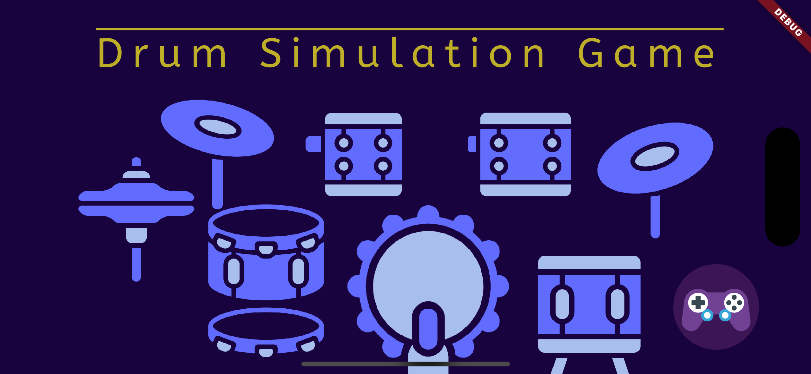
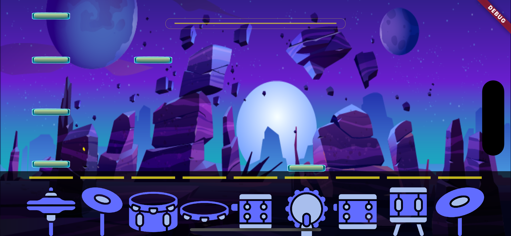
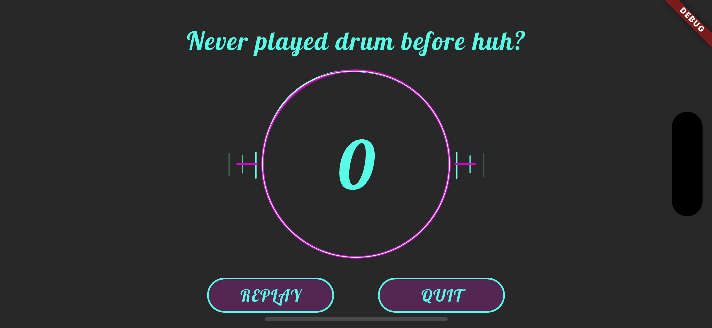

# DRUM SIMULATION
## Description
Open Source Software Practice course, SKKU 2024
Small Drum Simulation Game for all platforms
해당 프로젝트는 Flutter & Dart을 이용한 Cross Platform Application이며, Flame Game Engine을 이용해 개발했습니다.
Flutter와 Riverpod을 사용하여 상태 관리를 구현하였으며, Flame 엔진을 사용하여 게임 그래픽과 애니메이션을 처리합니다.

## 구현 기능
* Touch로 각 부분 별로 연주할 수 있음
* 게임 모드에서는 속도로서 세가지 다른 레벨을 구성했으며 각 게임에서 입력 받은 시각과 하드코딩 된 음악의 TimeLine을 비교해 점수화함.
* 비트와 각 드럼 요소들은 서로 충돌을 감지하므로 가만히 두어도 연주가 됨.

## Features
- 다양한 드럼 키트 제공
- 사용자가 입력한 드럼 비트를 기록하고 분석
- 다양한 레벨 제공
- 점수 시스템
- 게임 배경 및 애니메이션 효과

### Main Components

	•	MainGameScreen: 게임의 메인 화면으로, 드럼 키트와 게임 로직을 관리합니다.
	•	DrumKit: 사용자가 인터랙션할 수 있는 드럼 키트를 정의합니다.
	•	Beat: 각 드럼 비트를 정의합니다.
	•	GameBackground: 게임 배경을 설정합니다.
	•	PauseButton: 게임을 일시정지할 수 있는 버튼입니다.

# Installation & Play
## Flutter
Flutter는 Cross Platform에서의 개발에 매우 용이하므로 아래 제시된 도메인 모든 곳에서 실행 할 수 있습니다.
|도메인|      지원 여부 |
|---------|-------|
|Web        | :o: |
|Android    | :o: |
|iOS        | :o: |
|MacOS      | :o: |

### Prerequisites
- Flutter SDK (>= 2.0.0)
- Dart (>= 2.12.0)

먼저 Flutter를 다운로드 받아주세요.
1. clone 해주세요.
2. 해당 디렉토리까지 이동해주세요.
3. 의존성을 설치하고 확인해주세요.
```bash
flutter pub get
```
4. 실행해주세요.
```bash
flutter run
```

## 실행 예시
### 메인 화면

### 게임 플레이 화면

### 점수 화면

 
This project is a starting point for a Flutter application.

A few resources to get you started if this is your first Flutter project:

- [Lab: Write your first Flutter app](https://docs.flutter.dev/get-started/codelab)
- [Cookbook: Useful Flutter samples](https://docs.flutter.dev/cookbook)

For help getting started with Flutter development, view the
[online documentation](https://docs.flutter.dev/), which offers tutorials,
samples, guidance on mobile development, and a full API reference.
